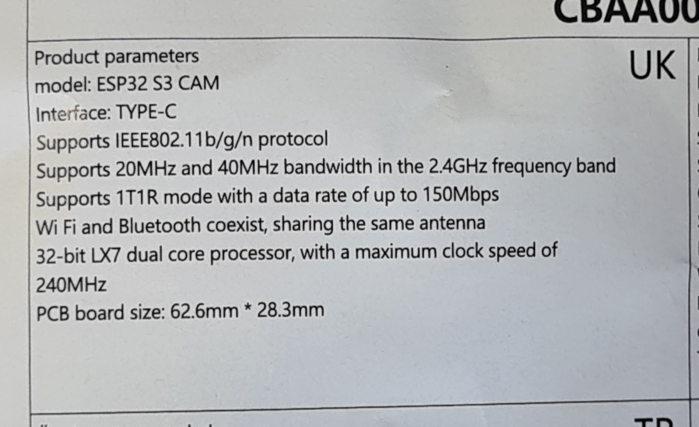

- [ESP-IDF](https://docs.espressif.com/projects/esp-idf/en/v6.0.1/esp32s3/index.html)
- [Board User Manual](./CBAA0046-052_UK.pdf)
- 
- [MicroPython](https://micropython.org/)
- [Blinds User Manual](./smartview-quick-start-guide.pdf)
- [Blinds Control Open Source Project](https://github.com/pink88/Tuiss2HA)

## Self-Signed SSL Certificates

To enable a warning-free HTTPS connection to the ESP32 from your PC and Android devices, you must generate the certificates and install them as a Root CA.

### Generating the Certificates
You can generate and flash the SSL certificates to the ESP32 using the Makefile. Provide the exact IP and DNS name to ensure they are added to the Subject Alternative Names (SAN):
```bash
make certs DNS=esp32.local IP=192.168.1.56
make flash
```
*(This generates the certificate with the `CA:true` constraint required by modern Android devices).*

### Installing the Certificate on PC (Chrome / Brave / Edge)
Because modern browsers use their own certificate stores, you must import the certificate directly into the browser settings:
1. Open Chrome and navigate to `chrome://settings/certificates`.
2. Look for **Local certificates** or **Authorities**.
3. Under the **Custom > Installed by you** section, find **Trusted Certificates**.
4. Click **Import** and select the generated `cert.pem` file.
5. Check the box to "Trust this certificate for identifying websites".
6. Fully restart your browser.

### Installing the Certificate on Android (Samsung)
Android is notoriously strict about certificates. The "Install network certificates" menu is for Wi-Fi authentication and will mistakenly ask for a private key. You must use the correct CA menu:

1. Transfer the `cert.pem` (or `cert.crt`) file to your Android device.
2. Go to **Settings** -> **Security and privacy** -> **More security settings** -> **Install from device storage**.
3. Tap the exact option that says **CA certificate**. *(Do not tap VPN, App, or Wi-Fi certificate!)*
4. A warning saying "Your data won't be private" will appear. Tap **Install anyway**.
5. Select the `cert.pem` file.
6. Open your mobile browser and navigate directly to the IP address: `https://192.168.1.56`. *(Note: Android natively lacks mDNS support, so `https://esp32.local` will usually not work).*
